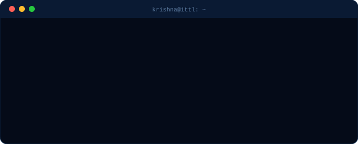
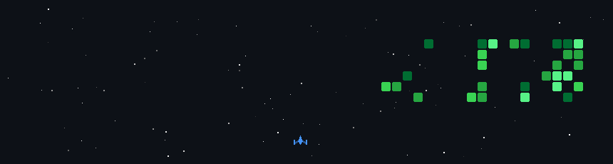

<!-- ══════════ HERO (hand-drawn animated SVG: assets/hero.svg) ══════════ -->


<div align="center">


<a href="mailto:Krishna.Raju@indo-tech.com"></a>
<a href="https://krishna-ittl.github.io/Job-Lens/"></a>
<a href="https://krishna-ittl.github.io/dmat-practice/"></a>


<br/><br/>



</div>


<!-- ══════════ PITCH ══════════ -->
<h2 align="center">🧲 Why you'll want to stick around</h2>

<table align="center">
<tr>
<td align="center" width="33%">🏭<br/><b>Shipped, not "side-projected"</b><br/><sub>My code runs dispatch, gate passes<br/>and testing on a real shop floor</sub></td>
<td align="center" width="33%">⚡<br/><b>Hours → seconds</b><br/><sub>PDF in, BOM + Excel out.<br/>Resumes in, ranked shortlist out.</sub></td>
<td align="center" width="33%">🔒<br/><b>Secure by default</b><br/><sub>Row-level security, role-based access<br/>and offline-first when data is sensitive</sub></td>
</tr>
</table>


<!-- ══════════ PROJECTS ══════════ -->
<h2 align="center">🚀 Live on the Grid</h2>

| | Project | The flex | Stack | Status |
|:-:|:--|:--|:--|:-:|
| 🚚 | **Dispatch Management System** | Work order → packing → loading → vehicle gate → out the door. 5 roles, dispatch calendar, auto email escalations, server-down alerts, 128 tests guarding it | `React 19` `Vite` `Supabase` `PL/pgSQL` `Vitest` |  |
| 🔍 | [**Job Lens**](https://github.com/krishna-ITTL/Job-Lens) | Every resume read, the best ones on top. Scores against one rubric, checks ATS readiness, works fully offline or with Claude / ChatGPT / Gemini | `TypeScript` `React` `Transformers.js` `Tesseract.js` `GSAP` | [](https://krishna-ittl.github.io/Job-Lens/) |
| 🧰 | [**RTCC & M.Box Tracker**](https://github.com/krishna-ITTL/RTCC-and-M.BOX-PROJECT) | Inspection → testing → clearance for RTCC panels & marshalling boxes. Chases pending points with 48-hour auto emails so nobody has to | `React` `Express` `node-cron` `Nodemailer` `Postgres` |  |
| 📊 | [**Testing Data Acquisition**](https://github.com/krishna-ITTL/Testing-s-Data-Acquisition-) | Transformer test data, captured clean, exported to Excel, tagged with QR codes | `React` `Express` `sql.js` `ExcelJS` |  |
| 📅 | [**EPMS**](https://github.com/krishna-ITTL/Project-Management-System) | Glassmorphism project HQ with Gantt charts, milestones, tasks and team management | `TypeScript` `React` `Express` `Tailwind` `Supabase` |  |
| 🔩 | [**Fasteners Automation**](https://github.com/krishna-ITTL/Fasteners-Project) | Drop a hardware PDF, get a weighted BOM in Excel + PDF. A whole afternoon of manual entry, gone | `Python` `Tkinter` |  |
| 🧠 | [**dMAT Master Practice**](https://github.com/krishna-ITTL/dmat-practice) | Exam simulator in **one HTML file**: timed mock tests, per-question timing, weakness analysis. 990 automated checks | `HTML` `CSS` `JS` | [](https://krishna-ittl.github.io/dmat-practice/) |

<div align="center">
<a href="https://github.com/krishna-ITTL/Job-Lens"></a>
<a href="https://github.com/krishna-ITTL/dmat-practice"></a>
</div>


<!-- ══════════ LANGUAGES (assets/languages.svg — measured from my repos) ══════════ -->
<h2 align="center">🧬 What my code is made of</h2>

<div align="center">

</div>

<!-- ══════════ STACK ══════════ -->
<h2 align="center">🔌 The Stack I Actually Ship With</h2>

<div align="center">

**Languages**<br/>


**Frontend & Motion**<br/>
<br/>


**Backend & Data**<br/>
<br/>


**AI in the browser**<br/>


**Ship & Guard**<br/>
<br/>


</div>


<!-- ══════════ METERS ══════════ -->
<h2 align="center">📟 Meter Readings</h2>

<div align="center">


</div>


<!-- ══════════ ARCADE (rebuilt nightly from my contributions by .github/workflows) ══════════ -->
<h2 align="center">🕹️ The Arcade</h2>
<p align="center"><sub>Every game below is played <b>on my real contribution graph</b> and rebuilt every night. More commits = longer levels.</sub></p>

<div align="center">

**🚀 Space Shooter**: my commits are the alien fleet<br/>


**🐍 Snake**: eats every green square I earn<br/>
<picture>
  <source media="(prefers-color-scheme: dark)" srcset="https://raw.githubusercontent.com/krishna-ITTL/krishna-ITTL/output/snake-dark.svg"/>
  
</picture>

</div>

<details>
<summary><b>👾 Insert coin for Pac-Man</b></summary>
<br/>
<picture>
  <source media="(prefers-color-scheme: dark)" srcset="https://raw.githubusercontent.com/krishna-ITTL/krishna-ITTL/output/pacman-contribution-graph-dark.svg"/>
  
</picture>
</details>

<details>
<summary><b>🧱 Insert coin for Breakout</b></summary>
<br/>
<picture>
  <source media="(prefers-color-scheme: dark)" srcset="https://raw.githubusercontent.com/krishna-ITTL/krishna-ITTL/output/breakout-contribution-graph-dark.svg"/>
  
</picture>
</details>

<!-- ══════════ FOOTER ══════════ -->
<div align="center">

<br/>

```text
 ┌────────────────────────────────────────────────────┐
 │  STATUS: ● ONLINE        LOAD: ████████░░  80%     │
 │  Got a process that eats your team's afternoon?    │
 │  Send it over. I'll turn it into a button.         │
 └────────────────────────────────────────────────────┘
```


</div>
